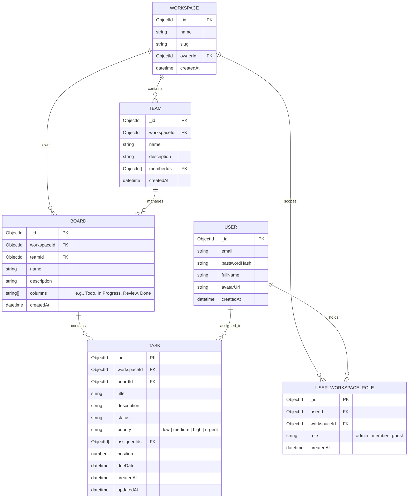
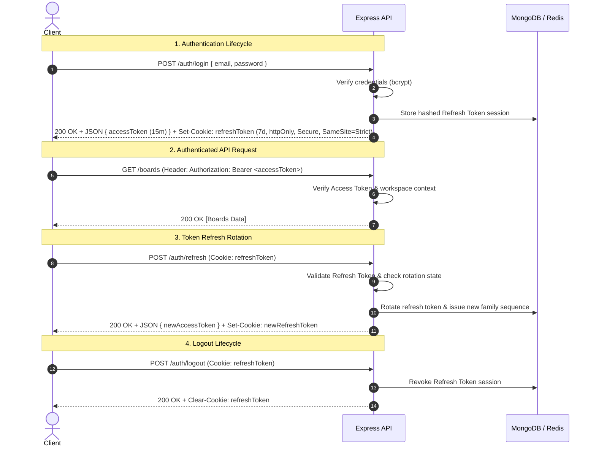

# LiveOps — System Architecture & Data Specification

## 1. Executive Overview

**LiveOps** is a production-grade, multi-tenant, real-time team collaboration platform built on the MERN stack (MongoDB, Express, React, Node.js) paired with Socket.io for real-time synchronization and the Anthropic Claude API for AI-assisted workspace intelligence.

---

## 2. Core Data Model & Entity Relationships

The data model establishes strict hierarchy and scoping. Every entity below `Workspace` is anchored to a `workspaceId` to guarantee query-level multi-tenant isolation.



### Key Schema Compound Indexes
To ensure fast performance and prevent cross-tenant data leakage, the database requires compound indexes on every collection:
- **`Board`**: `{ workspaceId: 1, createdAt: -1 }`
- **`Task`**: `{ workspaceId: 1, boardId: 1, position: 1 }`
- **`UserWorkspaceRole`**: `{ userId: 1, workspaceId: 1 }` (unique constraint)

---

## 3. Multi-Tenancy Strategy & Data Isolation Policy

### Query-Level Scoping Mechanism
Data isolation in LiveOps is enforced strictly at the database query layer, not just in the UI presentation layer.

1. **Workspace Context Middleware (`scopeWorkspace`)**:
   - Extracts the target `workspaceId` from HTTP headers (`X-Workspace-ID`) or request parameters.
   - Verifies the authenticated user's access rights against `UserWorkspaceRole` for that specific workspace.
   - Injects `req.workspaceId` and `req.userRole` into the Express request context.

2. **Strict Query Injection**:
   - Every database query for boards, tasks, teams, and analytics **must explicitly include `workspaceId: req.workspaceId`** in its query filter.
   - Example (Task Fetch):
     ```javascript
     // REQUIRED PATTERN
     const tasks = await Task.find({ _id: taskId, workspaceId: req.workspaceId });
     ```

3. **Cross-Tenant Security Boundary**:
   - If a user attempts to access a resource using a valid `taskId` that belongs to a workspace they are not a member of, the query returns `404 Not Found` (or `403 Forbidden`), preventing resource enumeration attacks.

---

## 4. Authentication & JWT Token Lifecycle

LiveOps uses a dual-token authentication pattern with short-lived Access Tokens and long-lived, rotated Refresh Tokens stored in secure HTTP-only cookies.



### Security Tokens Breakdown
- **Access Token**: JWT signed with `JWT_ACCESS_SECRET`, payload `{ userId, email }`, expiration **15 minutes**. Sent via `Authorization: Bearer <token>`.
- **Refresh Token**: Opaque random hex / JWT signed with `JWT_REFRESH_SECRET`, expiration **7 days**. Stored in `httpOnly`, `Secure`, `SameSite=Strict` cookie.
- **Rotation Policy**: On `/auth/refresh`, the old refresh token is invalidated immediately and replaced with a new token. If an already-invalidated refresh token is presented, the system flags potential token theft and revokes all refresh tokens for that user session family.

---

## 5. WebSocket Event Map (Socket.io)

### Room Scoping Model
Upon socket handshake authentication:
1. Client submits Access Token via socket `auth` handshake object (`io({ auth: { token } })`).
2. Server validates JWT.
3. Server automatically subscribes the client socket to room `workspace:<workspaceId>`.
4. All real-time broadcasts are targeted exclusively to `workspace:<workspaceId>`.

### Complete Event Specification Matrix

| Event Name | Direction | Payload Schema | Description |
| :--- | :--- | :--- | :--- |
| `presence:online` | Server → Client | `{ userId, workspaceId, timestamp }` | Broadcast when a team member connects |
| `presence:offline` | Server → Client | `{ userId, workspaceId, timestamp }` | Broadcast when a team member disconnects |
| `cursor:move` | Client → Server → Client | `{ userId, userName, x, y, boardId }` | Throttled (20ms) cursor position update |
| `task:created` | Server → Client | `{ task: TaskObject, createdBy }` | Emitted when a new task is created |
| `task:updated` | Server → Client | `{ taskId, updates, updatedBy }` | Emitted when task details are edited |
| `task:moved` | Server → Client | `{ taskId, sourceColumn, targetColumn, newPosition, movedBy }` | Emitted when a task card is dragged/reordered |
| `task:deleted` | Server → Client | `{ taskId, boardId, deletedBy }` | Emitted when a task is removed |
| `board:updated` | Server → Client | `{ boardId, columns, updatedBy }` | Emitted when board columns or metadata change |

---

## 6. Directory Structure & Architecture Boundaries

```
LiveOps/
├── docs/
│   ├── ARCHITECTURE.md          # System Architecture & Technical Specifications
│   └── README.md                # Docs Index
├── client/                      # React + Vite Frontend
│   ├── src/
│   │   ├── components/          # UI Components (Auth, Board, Task, AI Panel)
│   │   ├── context/             # AuthContext, WorkspaceContext, SocketContext
│   │   ├── services/            # API client (Axios with auto-refresh interceptors)
│   │   ├── types/               # TypeScript interfaces
│   │   └── App.tsx
│   ├── .env.example
│   └── package.json
├── server/                      # Node.js + Express + Socket.io Backend
│   ├── src/
│   │   ├── config/              # DB connection, JWT config, CORS setup
│   │   ├── middleware/          # requireAuth, requireRole, scopeWorkspace, rateLimiter
│   │   ├── models/              # Mongoose schemas (User, Workspace, Board, Task, etc.)
│   │   ├── routes/              # Express controllers (Auth, Workspace, Board, Task, AI)
│   │   ├── sockets/             # Socket.io event handlers and room manager
│   │   ├── services/            # Claude API integration & AI prompt services
│   │   └── server.js            # Express app & Socket server entry point
│   ├── .env.example
│   └── package.json
└── .gitignore
```
